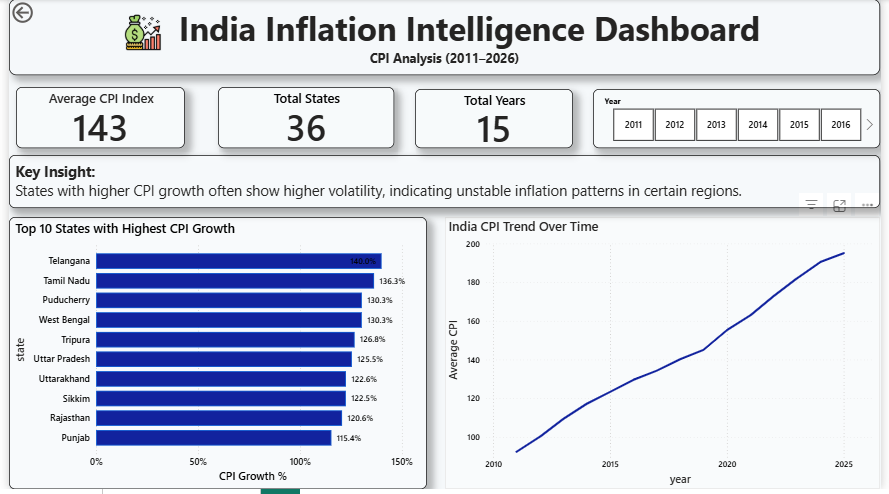
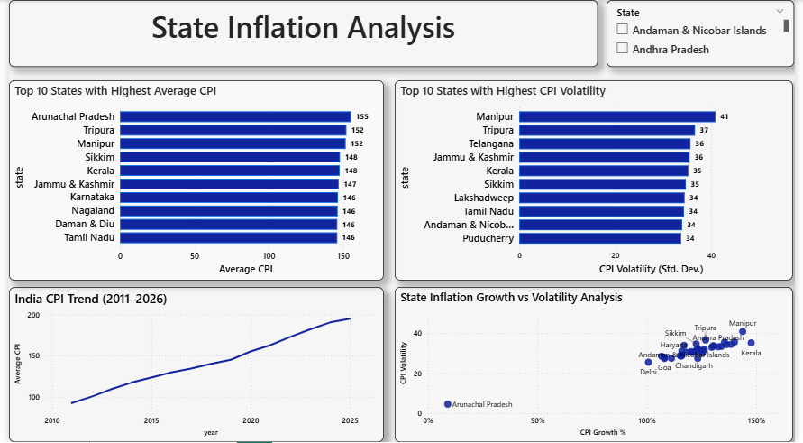

# India Inflation Intelligence System

## Project Overview
This project analyzes India's Consumer Price Index (CPI) data from 2011–2026 to identify inflation trends, state-wise growth patterns, and price volatility. The project demonstrates an end-to-end data analysis workflow using Python, SQL, and Power BI.

## Tools & Technologies
Python (Pandas, Matplotlib)
SQL (Data analysis queries)
Power BI (Interactive dashboard)
Jupyter Notebook

## Project Workflow
1. Data Cleaning and preprocessing using Python
2. Exploratory data analysis and visualization
3. SQL queries for analytical insights
4. Interactive Power BI dashboard development

## Key Insights
• India's CPI index shows a steady upward trend from 2011 to 2026  
• Certain states show significantly higher CPI growth  
• Some states exhibit high volatility indicating unstable inflation patterns

## Dashboard Preview

## Repository Structure

CPI_Inflation_analysis
│
├── clean_cpi_data.csv
├── cpi_data_cleaning_and_analysis.ipynb
├── cpi_analysis_queries.sql
├── India_Inflation_Dashboard.pbix
└── README.md
