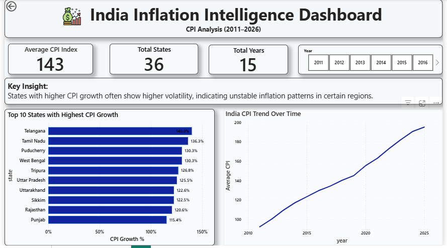
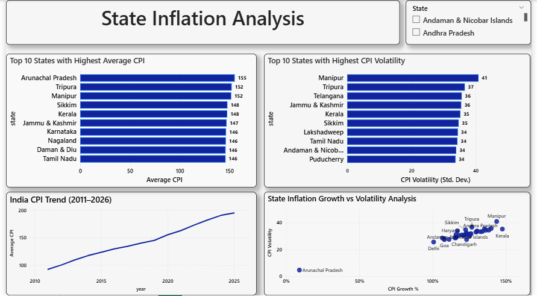

# 📊 India CPI Inflation Analysis: Identifying Key Drivers & Economic Trends

## 📌 Project Overview
This project analyzes India's Consumer Price Index (CPI) data from 2011–2026 to identify key inflation trends, understand category and state-wise contributions, and uncover patterns that can support economic and policy-level decision-making.

The project demonstrates an end-to-end data analysis workflow including data cleaning, exploratory analysis, SQL-based querying, and dashboard visualization.

---

## 🛠 Tools & Technologies
- Python (Pandas, Matplotlib)
- SQL (Analytical queries)
- Power BI (Interactive dashboard)
- Jupyter Notebook

---

## 🔄 Project Workflow
1. Data cleaning and preprocessing using Python  
2. Exploratory data analysis (EDA)  
3. SQL-based analysis for deeper insights  
4. Power BI dashboard for visualization and storytelling  

---

## 📈 Key Insights
- India's CPI shows a consistent upward trend, indicating long-term inflation growth  
- Certain states contribute disproportionately to inflation, highlighting regional disparities  
- High volatility in specific states suggests unstable price conditions  
- Inflation patterns indicate possible seasonal or policy-driven fluctuations  
- Price increases are not uniform across regions, suggesting targeted economic interventions are required  

---

## 💡 Business Recommendations
- Focus on high-impact states to control inflation more effectively  
- Monitor volatile regions closely to prevent economic instability  
- Implement region-specific policies instead of uniform nationwide strategies  
- Track inflation-sensitive categories (e.g., food, fuel) for better control measures  

---

## 📊 Dashboard Preview

---

## CPI_Inflation_analysis
│
├── clean_cpi_data.csv
├── cpi_data_cleaning_and_analysis.ipynb
├── cpi_analysis_queries.sql
├── India_Inflation_Dashboard.pbix
└── README.md

## 📂 Repository Structure
